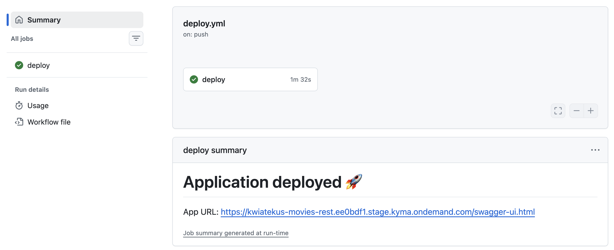

# Fast Prototyping on SAP BTP Kyma: App Push

This tutorial shows how to deploy a single-container application to SAP BTP Kyma runtime in one CLI command using `kyma app push`, then evolve it into an automated GitHub Actions CD pipeline. No YAML hand-crafting, no container registry setup, no CI/CD pipeline to configure upfront — just code → deploy → iterate.

It is a good fit when you have an app in any language supported by [Cloud Native Buildpacks](https://buildpacks.io/) (Java, Node.js, Go, Python, .NET) and want a clear path from local development to a working prototype in the SAP BTP context — all without writing a Dockerfile.

> **Note:** For lightweight event-driven workloads where you want zero container knowledge, see [Fast Prototyping With Serverless Functions](01-50-fast-prototyping-serverless-functions.md).

## Prerequisites

- [Kyma CLI](https://help.sap.com/docs/btp/sap-business-technology-platform/kyma-cli?locale=en-US#install-kyma-cli) installed.
- An [SAP BTP Kyma runtime](https://help.sap.com/docs/btp/sap-business-technology-platform/kyma-environment) provisioned in your subaccount.
- The following [Kyma modules enabled](https://help.sap.com/docs/btp/sap-business-technology-platform/enable-and-disable-kyma-module#adding-a-kyma-module) on your runtime:
  - **Istio** (enabled by default) — service mesh and networking
  - **API Gateway** (enabled by default) — external exposure via APIRule
  - **BTP Operator** (enabled by default) — manages BTP service instances and bindings
  - **Docker Registry** ([community module](https://kyma-project.io/external-content/community-modules/docs/user/README.html#quick-install)) — in-cluster container registry for building and storing images (no external registry needed)
- Your SAP BTP subaccount must be entitled to use the SAP Object Store service (service plan `standard`). Add the entitlement in the BTP cockpit under **Entitlements** if not already assigned.

## Step 1: Create Your App

For this example, use a Spring Boot application that exposes a REST API for managing movies, storing data in BTP Object Store. A ready-to-use version of this application is available in the [`examples/movies-api`](../../../examples/movies-api) folder.

To build the application from scratch:

```bash
mkdir "movies-rest" && cd "movies-rest"
```

Create the Maven project structure:

```bash
mkdir -p src/main/java/com/example/movies
```

**pom.xml**:

```xml
<?xml version="1.0" encoding="UTF-8"?>
<project xmlns="http://maven.apache.org/POM/4.0.0"
         xmlns:xsi="http://www.w3.org/2001/XMLSchema-instance"
         xsi:schemaLocation="http://maven.apache.org/POM/4.0.0 http://maven.apache.org/xsd/maven-4.0.0.xsd">
    <modelVersion>4.0.0</modelVersion>

    <parent>
        <groupId>org.springframework.boot</groupId>
        <artifactId>spring-boot-starter-parent</artifactId>
        <version>3.3.0</version>
    </parent>

    <groupId>com.example</groupId>
    <artifactId>movies</artifactId>
    <version>1.0.0</version>

    <properties>
        <java.version>21</java.version>
    </properties>

    <dependencyManagement>
        <dependencies>
            <dependency>
                <groupId>com.sap.cloud.environment.servicebinding</groupId>
                <artifactId>java-bom</artifactId>
                <version>0.10.5</version>
                <type>pom</type>
                <scope>import</scope>
            </dependency>
        </dependencies>
    </dependencyManagement>

    <dependencies>
        <dependency>
            <groupId>org.springframework.boot</groupId>
            <artifactId>spring-boot-starter-web</artifactId>
        </dependency>
        <dependency>
            <groupId>org.springdoc</groupId>
            <artifactId>springdoc-openapi-starter-webmvc-ui</artifactId>
            <version>2.5.0</version>
        </dependency>
        <dependency>
            <groupId>com.sap.cloud.environment.servicebinding</groupId>
            <artifactId>java-sap-service-operator</artifactId>
        </dependency>
        <dependency>
            <groupId>software.amazon.awssdk</groupId>
            <artifactId>s3</artifactId>
            <version>2.25.0</version>
        </dependency>
    </dependencies>

    <build>
        <plugins>
            <plugin>
                <groupId>org.springframework.boot</groupId>
                <artifactId>spring-boot-maven-plugin</artifactId>
            </plugin>
        </plugins>
    </build>
</project>
```

**src/main/java/com/example/movies/Application.java**:

```java
package com.example.movies;

import io.swagger.v3.oas.annotations.OpenAPIDefinition;
import io.swagger.v3.oas.annotations.info.Info;
import org.springframework.boot.SpringApplication;
import org.springframework.boot.autoconfigure.SpringBootApplication;

@SpringBootApplication
@OpenAPIDefinition(info = @Info(
        title = "Movies API",
        version = "1.0.0",
        description = "CRUD REST service for movies, backed by SAP BTP Object Store"))
public class Application {
    public static void main(String[] args) {
        SpringApplication.run(Application.class, args);
    }
}
```

**src/main/java/com/example/movies/ObjectStoreConfig.java**:

```java
package com.example.movies;

import com.sap.cloud.environment.servicebinding.api.DefaultServiceBindingAccessor;
import com.sap.cloud.environment.servicebinding.api.ServiceBinding;
import com.sap.cloud.environment.servicebinding.api.ServiceBindingAccessor;
import org.springframework.context.annotation.Bean;
import org.springframework.context.annotation.Configuration;
import software.amazon.awssdk.auth.credentials.AwsBasicCredentials;
import software.amazon.awssdk.auth.credentials.StaticCredentialsProvider;
import software.amazon.awssdk.regions.Region;
import software.amazon.awssdk.services.s3.S3Client;

import java.net.URI;
import java.util.Map;

@Configuration
public class ObjectStoreConfig {

    @Bean
    public S3Client s3Client() {
        ServiceBindingAccessor accessor = DefaultServiceBindingAccessor.getInstance();

        ServiceBinding binding = accessor.getServiceBindings().stream()
                .filter(b -> "objectstore".equals(b.getServiceName().orElse(null)))
                .findFirst()
                .orElseThrow(() -> new IllegalStateException("No matching Object Store binding found"));

        Map<String, Object> creds = binding.getCredentials();

        return S3Client.builder()
                .region(Region.of((String) creds.get("region")))
                .endpointOverride(URI.create("https://" + creds.get("host")))
                .credentialsProvider(StaticCredentialsProvider.create(
                        AwsBasicCredentials.create(
                                (String) creds.get("access_key_id"),
                                (String) creds.get("secret_access_key"))))
                .build();
    }

    @Bean
    public String bucketName() {
        ServiceBindingAccessor accessor = DefaultServiceBindingAccessor.getInstance();
        ServiceBinding binding = accessor.getServiceBindings().stream()
                .filter(b -> "objectstore".equals(b.getServiceName().orElse(null)))
                .findFirst()
                .orElseThrow();
        return (String) binding.getCredentials().get("bucket");
    }
}
```

**src/main/java/com/example/movies/Movie.java**:

```java
package com.example.movies;

import io.swagger.v3.oas.annotations.media.Schema;

@Schema(description = "Movie resource")
public record Movie(
        @Schema(description = "Auto-generated ID", example = "1714900000000", accessMode = Schema.AccessMode.READ_ONLY)
        String id,
        @Schema(description = "Movie title", example = "Blade Runner")
        String title,
        @Schema(description = "Release year", example = "1982")
        int year,
        @Schema(description = "Director name", example = "Ridley Scott")
        String director,
        @Schema(description = "Rating out of 10", example = "8.1")
        Double rating) {
    public Movie withId(String newId) {
        return new Movie(newId, title, year, director, rating);
    }
}
```

**src/main/java/com/example/movies/MovieController.java**:

```java
package com.example.movies;

import com.fasterxml.jackson.databind.ObjectMapper;
import io.swagger.v3.oas.annotations.Operation;
import io.swagger.v3.oas.annotations.tags.Tag;
import org.springframework.http.HttpStatus;
import org.springframework.web.bind.annotation.*;
import org.springframework.web.server.ResponseStatusException;
import software.amazon.awssdk.core.sync.RequestBody;
import software.amazon.awssdk.services.s3.S3Client;
import software.amazon.awssdk.services.s3.model.*;

import java.io.IOException;
import java.util.List;

@RestController
@RequestMapping("/movies")
@Tag(name = "Movies", description = "CRUD operations for movie resources")
public class MovieController {

    private final S3Client s3;
    private final String bucket;
    private final ObjectMapper mapper = new ObjectMapper();

    public MovieController(S3Client s3, String bucketName) {
        this.s3 = s3;
        this.bucket = bucketName;
    }

    @GetMapping
    @Operation(summary = "List all movies")
    public List<Movie> list() throws IOException {
        ListObjectsV2Request request = ListObjectsV2Request.builder()
                .bucket(bucket)
                .prefix("movies/")
                .build();
        ListObjectsV2Response response = s3.listObjectsV2(request);
        return response.contents().stream()
                .map(obj -> getMovie(obj.key()))
                .toList();
    }

    @GetMapping("/{id}")
    @Operation(summary = "Get a movie by ID")
    public Movie get(@PathVariable String id) {
        return getMovie("movies/" + id + ".json");
    }

    @PostMapping
    @ResponseStatus(HttpStatus.CREATED)
    @Operation(summary = "Create a new movie")
    public Movie create(@org.springframework.web.bind.annotation.RequestBody Movie movie) throws Exception {
        Movie saved = movie.withId(String.valueOf(System.currentTimeMillis()));
        putMovie(saved);
        return saved;
    }

    @PutMapping("/{id}")
    @Operation(summary = "Update an existing movie")
    public Movie update(@PathVariable String id, @org.springframework.web.bind.annotation.RequestBody Movie movie) throws Exception {
        Movie saved = movie.withId(id);
        putMovie(saved);
        return saved;
    }

    @DeleteMapping("/{id}")
    @ResponseStatus(HttpStatus.NO_CONTENT)
    @Operation(summary = "Delete a movie")
    public void delete(@PathVariable String id) {
        DeleteObjectRequest request = DeleteObjectRequest.builder()
                .bucket(bucket)
                .key("movies/" + id + ".json")
                .build();
        s3.deleteObject(request);
    }

    private void putMovie(Movie movie) throws Exception {
        byte[] json = mapper.writeValueAsBytes(movie);
        PutObjectRequest request = PutObjectRequest.builder()
                .bucket(bucket)
                .key("movies/" + movie.id() + ".json")
                .contentType("application/json")
                .build();
        s3.putObject(request, software.amazon.awssdk.core.sync.RequestBody.fromBytes(json));
    }

    private Movie getMovie(String key) {
        try {
            GetObjectRequest request = GetObjectRequest.builder()
                    .bucket(bucket)
                    .key(key)
                    .build();
            byte[] data = s3.getObject(request).readAllBytes();
            return mapper.readValue(data, Movie.class);
        } catch (NoSuchKeyException e) {
            throw new ResponseStatusException(HttpStatus.NOT_FOUND, "Movie not found");
        } catch (IOException e) {
            throw new RuntimeException(e);
        }
    }
}
```

**src/main/resources/application.properties**:

```properties
server.port=8080
```

## Step 2: Create the BTP Object Store Service Instance and Binding

The application needs an Object Store service instance secret mounted into the workload.
Create the service instance and binding using the ServiceInstance and ServiceBinding custom resources:

```yaml
# service-instance.yaml
apiVersion: services.cloud.sap.com/v1
kind: ServiceInstance
metadata:
  name: object-store-instance
spec:
  serviceOfferingName: objectstore
  servicePlanName: standard
```

```yaml
# service-binding.yaml
apiVersion: services.cloud.sap.com/v1
kind: ServiceBinding
metadata:
  name: object-store-binding
spec:
  serviceInstanceName: object-store-instance
```

Apply both resources:

```bash
kubectl apply -f service-instance.yaml
kubectl apply -f service-binding.yaml
```

Wait for the binding to become ready:

```bash
kubectl get servicebindings object-store-binding -w
```

Once the status shows `Ready: True`, a Kubernetes Secret named `object-store-binding` is created in the namespace with the Object Store credentials. This secret is mounted to the application workload as part of `kyma app push` command execution.

## Step 3: Deploy

One command builds, pushes, and deploys your app — and exposes it externally:

```bash
kyma app push \
  --name movies-rest \
  --code-path . \
  --container-port 8080 \
  --expose \
  --istio-inject=true \
  --mount-service-binding-secret object-store-binding \
  --env-from-file .env
```

The `.env` file contains JVM memory tuning required to fit within the default 512Mi container limit:

```properties
BPL_JVM_THREAD_COUNT=20
JAVA_TOOL_OPTIONS=-XX:ReservedCodeCacheSize=40M -XX:MaxMetaspaceSize=80M -Xss512k
```

What happens under the hood:

1. Source code is built into a container image using [Cloud Native Buildpacks](https://buildpacks.io/) (Paketo).
2. Image is pushed to the in-cluster docker-registry.
3. A Deployment, Service, and APIRule are created.
4. The BTP Object Store binding secret is mounted at `/bindings/secret-object-store-binding`.
5. `SERVICE_BINDING_ROOT=/bindings` environment variable is set automatically.

> **Note:** No Dockerfile required. Buildpacks detect `pom.xml` and automatically build a Java application with the correct JDK. The same approach works for Node.js, Go, Python, .NET, and more.
>
> If you need more control over the image build, `kyma app push` also supports:
> - `--dockerfile <path>` — build the image from your own Dockerfile instead of using Buildpacks.
> - `--image <image>` — skip the build entirely and deploy a pre-built image already pushed to a registry.

## Step 4: Verify

The OpenAPI specification is available at `https://<YOUR-APP-URL>/v3/api-docs` and the interactive Swagger UI at `https://<YOUR-APP-URL>/swagger-ui.html`.
Use the Swagger UI to test the CRUD operations.


## Evolution: Move to GitHub Actions CD

Once your prototype stabilizes, automate deployments.
Push the code to a GitHub repository, for example `https://github.com/acme/movies-rest`, and authorize the repository's GitHub Actions workflows to apply changes in the target cluster.

To authorize the repository, run:

```bash
kyma alpha authorize repository \
  --client-id my-client-id-for-gh-action \
  --cluster-wide \
  --clusterrole edit \
  --repository acme/movies-rest
```

> **Note:** Use the most restrictive ClusterRole that satisfies your workflow's needs — `edit` is used here for simplicity, but consider a narrower role. You can also limit authorization to a specific workflow, branch, or environment by passing additional required OIDC claims with `--require-claim`. Run `kyma alpha authorize repository --help` for details.

Now you can automate deployments on every push to the main branch using the [`kyma-project/setup-kyma-cli/app-push`](https://github.com/kyma-project/setup-kyma-cli/tree/main/app-push) GitHub Action.

The action wraps the same `kyma app push` command you ran locally — same flags, same behavior. The workflow obtains cluster access using a GitHub OIDC token — no long-lived credentials are involved. The only values stored as secrets are the API server URL and CA certificate, which are not sensitive credentials but rather connection details needed to reach the cluster.

```yaml
name: Deploy

permissions:
  id-token: write
  contents: read

on:
  push:
    branches:
      - main

jobs:
  deploy:
    runs-on: ubuntu-latest
    steps:
      - uses: actions/checkout@v4

      - name: Setup Kyma CLI
        uses: kyma-project/setup-kyma-cli@v1.1.0

      - name: "get kubeconfig"
        id: oidc
        uses: kyma-project/setup-kyma-cli/kubeconfig@v1.1.0
        with:
          audience: "my-client-id-for-gh-action"
          api-server-url: "${{ secrets.SERVER }}" # fetch from secure secret store, i.e., Vault or GitHub secrets
          ca-crt: "${{ secrets.CA_CRT }}" # fetch from secure secret store, i.e., Vault or GitHub secrets
          id-token-auto-refresh: "true"

      - uses: kyma-project/setup-kyma-cli/app-push@v1.1.0
        with:
          name: movies-rest
          code-path: . # relative path of the source code
          container-port: "8080"
          expose: "true"
          istio-inject: "true"
          mount-service-binding-secret: object-store-binding
          kubeconfig: "${{ steps.oidc.outputs.kubeconfig }}"
          env-from-file: .env # relative path of the .env file
          append-output-path: /swagger-ui.html

```

Every push to `main` triggers a fresh build and deploy — no local tooling required.



## Summary

With `kyma app push` you go from source code to a running, externally accessible application with BTP service bindings in a single command. The same deployment can then be moved into a GitHub Actions workflow with zero code changes — just copy the flags into the action inputs.

This is not a throwaway prototype tool. The Deployment, Service, and APIRule it creates are standard Kubernetes resources you can later manage with Helm, Kustomize, or any GitOps tool.
